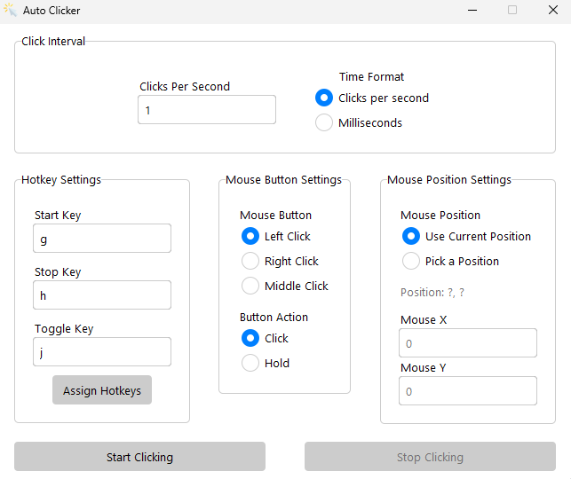
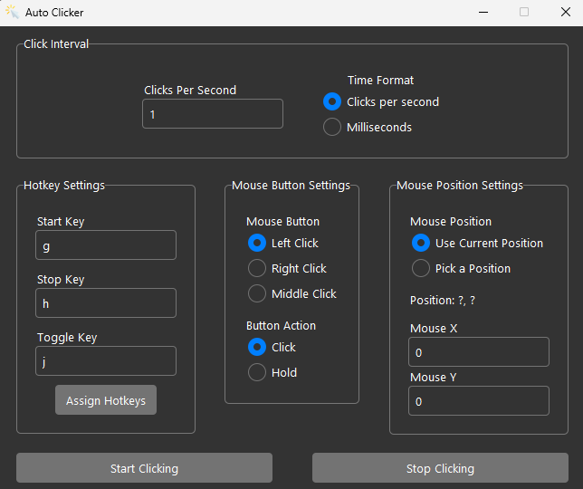

# AutoClicker
An autoclicker I made in Python. It has all the necessary features and even a dark and light mode.

    
Light theme

    </img>

    
Dark theme

    </img>

## How to install
1. Run "pip3 install -r requirements.txt"
2. Run main.py

## How to change to light / dark mode
All you need to do is change line 132 in interface.py:  
    - self._tk.call("set_theme", "light") -> self._tk.call("set_theme", "dark")  
You can also add your own custom themes. All you need to do is change line 131 in interface.py and define the path to the theme file. Currently themes are in "themes/THEME" folder.
